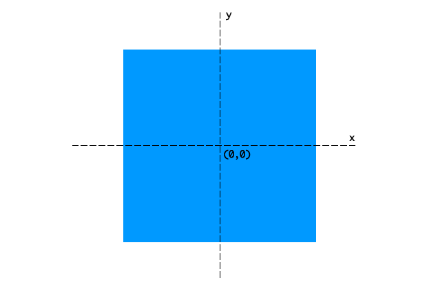
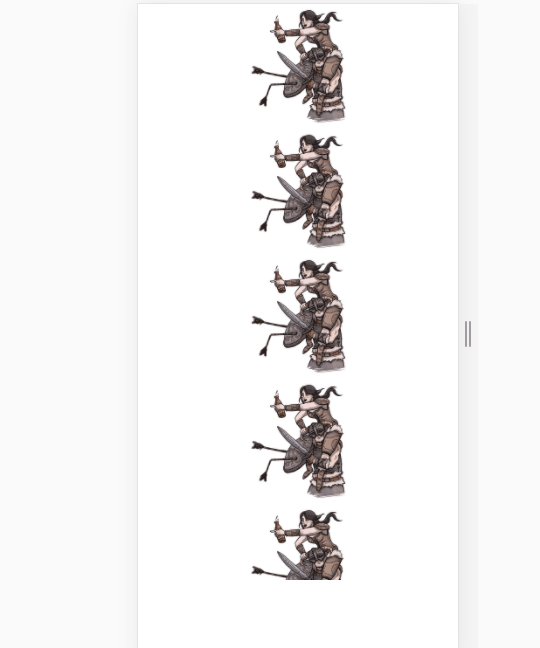

# transform
经过昨天的探索，得知了两种坐标系，笛卡尔坐标和齐次坐标。

为了计算方便，选择了齐次坐标进行计算，计算方式如下：

`matrix(a, b, c, d, tx, ty)` 

a, d 为缩放，值相等，由前后两张图片比例得出

b, c 为畸变，为0

tx, ty 则是相对坐标轴的偏移，通过 `scrollTop, scrollLeft`计算得出。

**ps: 这里的计算存在误差，需要想办法减少误差**

# animate
动画效果

